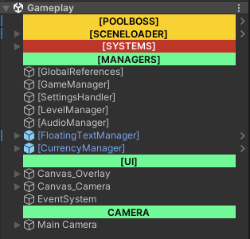
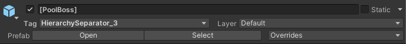
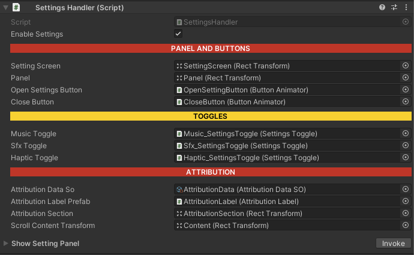

# Beautification

---

We have a few custom features that enable you to organize and beautify your project setup.

### Hierarchy Separators

Use this to sort and color-code the hierarchy.
Simply apply the relevant tags to apply the style.

---

### Inspector Horizontal Line

Use this to sort related items within a script.

---

