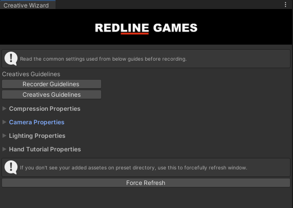

# Creative Package

---

We have a bunch of features packed into a single package that will help you speed up the development for CPI videos.

You can download the creative package [here](packages/CreativesPackage_v1.2.unitypackage "Creative Package")

Once imported, you can access all features via the top bar Creatives > Creative Wizard

### Features

---

#### <b>Guide</b>

Read through the Creatives Guidelines for better understanding of how to record videos

---

#### <b>Texture Compression</b>

Use this to uncompress all textures just of creatives. This can be reverted at any time to previous setting.

<b><i>Note:</b> Only use this when we need realistic, HQ textures. Not required for simple puzzle games</i>

---

#### <b>Camera Settings</b>

You can edit camera setting to toggle greyscale for specific layers, toggle SSAO, and change skyboxes. Camera settings can also be reverted easily.

<b><i>Note:</b> Greyscale does not work on overlay canvas</i>

---

#### <b>Lighting Settings</b>

Easily apply custom lighting using lighting data presets.

---

#### <b>Onboarding Hand</b>

Toggle a tutorial hand to show finger movement in videos. Right-click to toggle the hand visual.

---

#### <b>End Screens and CTA</b>

Custom end screens and a CTA screen template is provided with the package. Use them and customize as required.