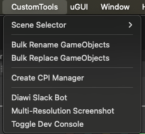
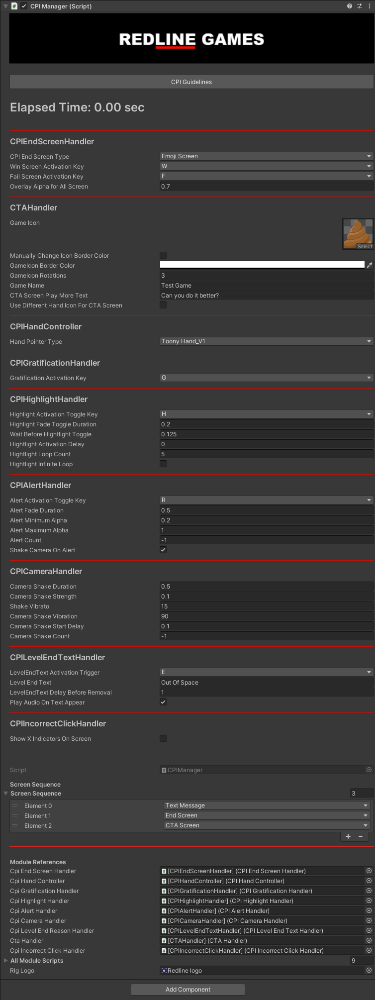

# Creative Package

---

We have a bunch of features packed into a single package that will help you speed up the development for CPI videos.

You can download the latest version of the creative package [here](packages/CreativePackage_v2.0.unitypackage "Creative Package")


Once imported, you can access all features via the [CPIManager] prefab.
To create the prefab, navigate to the top bar CustomTools > Create CPI Manager



### Features



#### <b>CPI Guidelines</b>

Read through the CPI Guidelines for better understanding of how to record videos and what to focus on.

---

#### <b>CPI End Screen Handler</b>

Allows selection of the type of end screen required among Emoji, Banner and Stamp. You can also set the keybinds to trigger Win and Fail sequences.

---

#### <b>CTA Handler</b>

Use the CTA handler properties to create a customised CTA screen with the required game name, icon and other properties.

---

#### <b>CPI Hand Controller</b>

Select which type of hand sprite you want to use. You can edit hand settings in the Scriptable Object located at _"Assets/CreativesSetup/HandPresets/CPIHandData"_.

```text
Left click => Hand tap animation
Right click => Incorrect click indication
Scroll click => Toggle hand visibility
```

---

#### <b>CPI Gratification Handler</b>

Set a keybind to spawn gratification text at target position.

---

#### <b>CPI Highlight Handler</b>

Use the CPI highlight handler to highlight specific areas of the game screen to grab attention.

---

#### <b>CPI Alert Handler</b>

The CPI alert handler allows you to add a full-screen vignette to alert the viewer or indicate urgency.

---

#### <b>CPI Camera Handler</b>

Set up the properties required for a camera shake effect.

---

#### <b>CPI Level End Text Handler</b>

This module allows you to show animated text commonly used to show reason for failure, like _"Out of Space!"_.

---

#### <b>CPI Incorrect Click Handler</b>

This module allows enabling 3 <b>X</b> indicators at the top of the screen that can be used to show wrong decisions made by the player.

---

#### <b>Screen Sequence</b>

You can define a list of screens that will automatically be called in sequence when Win or Fail is triggered via the CPI End Screen Handler