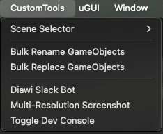
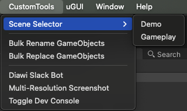
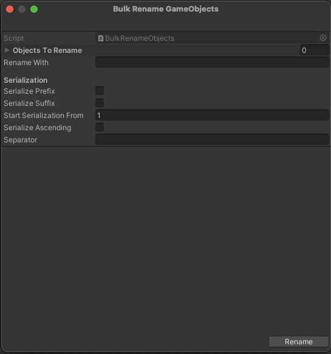
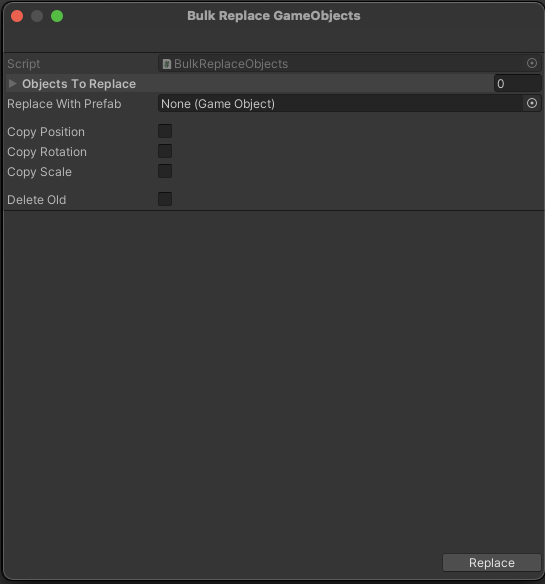
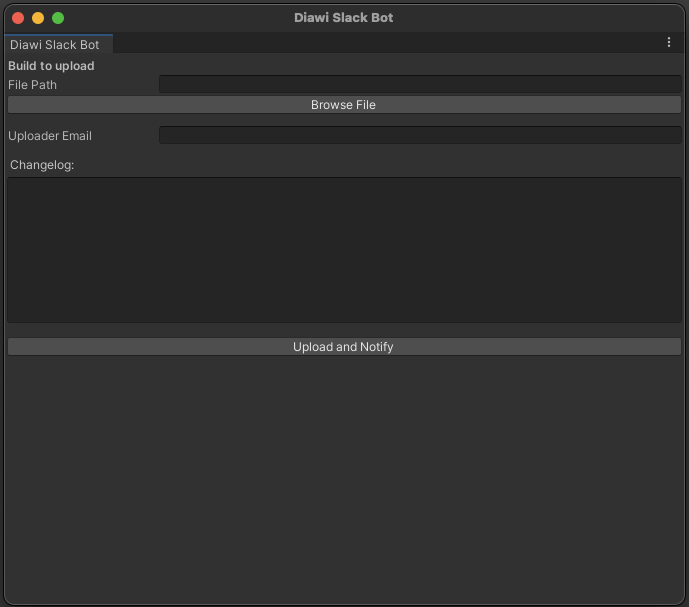
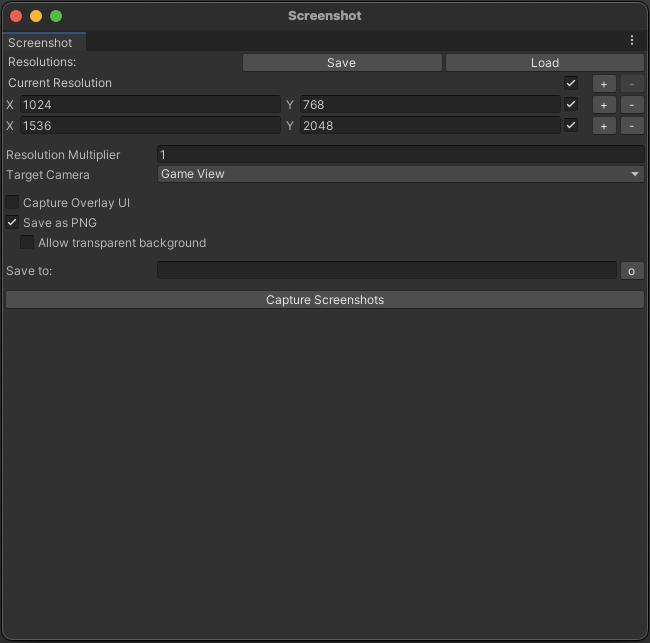

# Custom Tools

---

We have developed a few custom scripts that help with tedious tasks

These scripts are already integrated into the base project

You can access them through the top bar CustomTools

### Features

---

#### <b>Scene Selector</b>

This tool allows you to navigate to any scene that is included in the build

---

#### <b>Bulk Rename GameObjects</b>

Use this tool to rename multiple objects at once. The naming scheme supports prefixes, suffixes and serialization

---

#### <b>Bulk Replace GameObjects</b>

Use this tool to replace multiple objects with another prefab. You can copy transform properties and optionally choose to delete the old objects

---

#### <b>Diawi Slack Bot</b>

This tool can be used to upload IPA builds to Diawi for testing

---

#### <b>Multi-resolution Screenshot</b>

Use this to capture high quality screenshots in multiple aspect ratios

---

#### <b>Toggle Dev Console</b>

Helps enable/disable [Dev Console](devconsole.md) in the game
