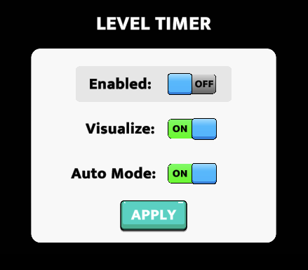

# Dev Console

---

Dev console is a custom package has has features which help the team test the game more efficiently

It is already integrated into the base project


You can enable/disable the dev console via the top bar CustomTools > Toggle Dev Console


Once enabled, the scene will show a + button. Clicking on it will open up the dev console


### Features

---

#### <b>Level Navigation Buttons</b>

Use these buttons to navigate to the previous and next levels


---

#### <b>Level End Buttons</b>

Use these buttons to trigger Level Fail or Level Complete states


---

#### <b>Level Selector</b>

This feature enables you to jump to a specific level


```text
Active level - Shows if current level is set via test level selector.
```
```text
Test level - Level number to load. For example, if value is 5, level 5 will be loaded.
```
```text
Test level after loop - Level number to load after the first loop of max levels. For example, if value is 5 and max levels in the game are 20, then whenever level 5 is loaded randomly after level 20, that level is loaded.
```
```text
Clear button - Stops loading test level. The game will resume original progression.
```
```text
Load button - Loads the level specified in either "Test level" or "Test level after loop".
```

---

#### <b>Currency Modifier</b>

Any currency in the scene will automatically be added to this section. You can use it to modify the amount at runtime.


---

#### <b>Save Data Modifier</b>

Any saved data - via PlayerPrefs or via EasySave can be cleared using this module. This makes it easy to reset the game for testing.


---

#### <b>Level Timer</b>

This module can be used to check the total time taken to clear/fail the level



```text
Enabled - Defines if the module is enabled or not.
```
```text
Visualize - If true, the timer module will be visible in the game.
```
```text
Auto Mode - If true, the timer starts and stops itself automatically based on in-game events like OnGameStarted, OnGamePaused, OnGameResumed, OnLevelComplete, OnLevelFailed.
```