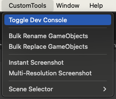
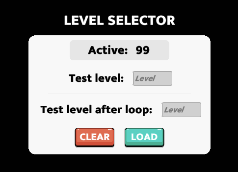
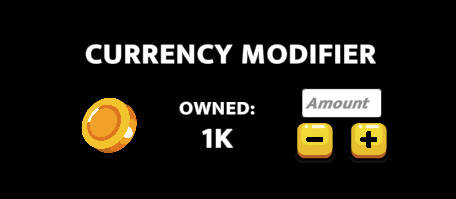

# Dev Console

---

Dev console is a custo package has has features which help the team test the game more efficiently

You can download the dev console package [here](packages/DevConsole_v1.0.unitypackage "Dev Console Package")


Once imported, you can enable/disable the dev console via the top bar CustomTools > Toggle Dev Console



Once enabled, the scene will show a + button. Clicking on it will open up the dev console


### Features

---

#### <b>Level Selector</b>

This feature enables you to jump to a specific level



```text
Active level - Shows if current level is set via test level selector.
```
```text
Test level - Level number to load. For example, if value is 5, level 5 will be loaded.
```
```text
Test level after loop - Level number to load after the first loop of max levels. For example, if value is 5 and max levels in the game are 20, then whenever level 5 is loaded randomly after level 20, that level is loaded.
```
```text
Clear button - Stops loading test level. The game will resume original progression.
```
```text
Load button - Loads the level specified in either "Test level" or "Test level after loop".
```

---

#### <b>Currency Modifier</b>

Any currency in the scene will automatically be added to this section. You can use it to modify the amount at runtime.


