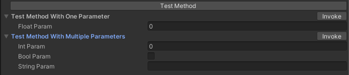

# Features

---

### Currency Manager

Money matters 💸.
<br>
Use one manager per currency, assign relevant data in the corresponding SO and you're set.

```text
[CurrencyManager] prefab can be found in Assets/Prefabs/Currency
Make sure the respective 2D and 3D currency prefabs are added in PoolBoss
```

---

### Pooling

Pool is cool 😎.
<br>
When you need a bunch of the same prefab multiple times, use pooling instead of spawning them at runtime for better runtime performance.

```text
Don't forget to add your prefabs to PoolBoss
```

---

### Level End Screens

Some wins 🎉, some fails ☠️.
<br>
A set of default screens have already been integrated for easy game flow.

```text
To customize, extend the LevelEndScreenBase script and create custom win and lose scripts
```

---

### Progress Bars

Keep progressing 📈.
<br>
A variety of progress bars have been pre-made for easy integration

```text
You can find the different types of progress bars in Assets/Prefabs/ProgressBar
```

---

### Haptics

Tap, vibrate, experience 📳.
<br>
Choose from pre-built presets like Success ✅, Failure ⚠️, Light 🪶, and Heavy 🪨 among others.

```text
Haptics can be accessed via the HapticsManager
```
---

### Audio

Let the music play.
<br>
Easily Play and manage music 🔊 and SFX 🔔 with customizable volume and pitch.

```text
Use AudioManager to handle any in-game sounds
```
---

### Scene Loader

Transition between scenes 🎬 seamlessly.
<br>
Use the Scene Loader and Transition Manager in tandem to load scenes with visible loading progress or just a generic loading screen.

```text
Transition manager supports different types of transitions that can be extended
```

---

### Settings

A pre-made settings ⚙️ panel has been created for your convenience.
<br>
Easily integrate toggles for music and haptics, as well as attributions for non-cc0 artwork.

```text
SettingsHandler deals with everything related to settings
To add attribution, add info in the AtrributionDataSO and it'll reflect automatically
```

---

### Button Attribute

Test with ease 👨🏻‍🔬.
<br>



```text
Use attribute [Button] to expose the method as shown in above image
```

---

### UI Particles

Particles ✨ always make things better.
<br>
Now integrate particle systems in overlay canvas.

```text
Add the UIParticleSystem component to render particles in UI
```

---

### UI Gradient

Add gradients 🎨 to UI Images for a more polished look.
<br>
You can make bland screens pop much more using simple vertical and horizontal gradients.

```text
Add the Gradient or Gradient2 component on any image
```

[UI Gradient example](gifs/9SlicedImage.gif "UI Gradient")

---

### Render Texture Creator

Render the world 🌏 in UI.
<br>
Easily set up dynamically created render textures that don't bloat your build size.

```text
RenderTextureCamera prefab can be found in Assets/Prefabs/RenderTextureCamera
Place it in scene, use the camera to set up your visuals, assign raw images, and hit play
Some helpful buttons are also provided on the script to help you
```

---


### Custom Shaders

Let the creative juices flow 🧠.
<br>
Some basic custom shaders to create effects like Checkerboard, Heat Haze, Stipple, Better Transparency

```text
All custom shader can be found in Assets/Shaders
```

---

### 3D Mask

Mask 🎭 3D objects in world space.
<br>
You can make objects be visible either inside or outside the mask object.

```text
Mask shaders can be found in Assets/Shaders/3DMask
An example showcasing this can be found in Assets/Prefabs/3DMask/3DMaskExample
```

---

### 9-sliced Circles

Life is a circle ⚪.
<br>
You can create a lot of UI just using a 9-sliced white circle sprite.

```text
The project already has Circle_512 and Circle_64 sprites that have been sliced
```

To use them, assign the sprite to an image component and play around with the 
"Pixels Per Unit Multiplier" value to get the desired rounding.

[9-slicing example](gifs/9SlicedImage.gif "9-Slicing")

---


### Extension Methods

#### &nbsp;&nbsp;&nbsp;&nbsp;&nbsp;&nbsp;Collections

&nbsp;&nbsp;&nbsp;&nbsp;&nbsp;&nbsp;Array and List extension menthods to shuffle, get random item, get random index, delete null elements, debug collection.

<br>

#### &nbsp;&nbsp;&nbsp;&nbsp;&nbsp;&nbsp;Scroll

&nbsp;&nbsp;&nbsp;&nbsp;&nbsp;&nbsp;Methods to auto-scroll to a specific point or item in the scrollview.

<br>

#### &nbsp;&nbsp;&nbsp;&nbsp;&nbsp;&nbsp;Animator Controller

&nbsp;&nbsp;&nbsp;&nbsp;&nbsp;&nbsp;Start animation from random frame, change speed of animations.

<br>

#### &nbsp;&nbsp;&nbsp;&nbsp;&nbsp;&nbsp;Camera

&nbsp;&nbsp;&nbsp;&nbsp;&nbsp;&nbsp;Transition camera positiona nd rotation, shake camera, change FOV.

<br>

#### &nbsp;&nbsp;&nbsp;&nbsp;&nbsp;&nbsp;TMP_Text

&nbsp;&nbsp;&nbsp;&nbsp;&nbsp;&nbsp;Animate numbers to easily show changing values.

---

### Utilities

#### &nbsp;&nbsp;&nbsp;&nbsp;&nbsp;&nbsp;Floating Text

&nbsp;&nbsp;&nbsp;&nbsp;&nbsp;&nbsp;Use it to show damage text, money earned/spent, etc.

```text
Floating text can be spawned via [FloatingTextManager]
```
<br>

#### &nbsp;&nbsp;&nbsp;&nbsp;&nbsp;&nbsp;Tags and Layers

&nbsp;&nbsp;&nbsp;&nbsp;&nbsp;&nbsp;Easily access all Tags and Layers as an Enum.

<br>

#### &nbsp;&nbsp;&nbsp;&nbsp;&nbsp;&nbsp;Custom Buttons

&nbsp;&nbsp;&nbsp;&nbsp;&nbsp;&nbsp;Create buttons easily vis pre-defined templates.

```text
To create a custon button, go to Create > UI > CustomButton
```

<br>

---

### Editor Scripts

These features can be accessed from top menu bar - CustomTools

##### &nbsp;&nbsp;&nbsp;&nbsp;&nbsp;&nbsp;Screenshot

&nbsp;&nbsp;&nbsp;&nbsp;&nbsp;&nbsp;Take high resolution screenshots of everything rendered in your game camera.

<br>

##### &nbsp;&nbsp;&nbsp;&nbsp;&nbsp;&nbsp;Object Renamer

&nbsp;&nbsp;&nbsp;&nbsp;&nbsp;&nbsp;Rename a bunch of scene objects together. It also supports ascending and decending serialization.

<br>

##### &nbsp;&nbsp;&nbsp;&nbsp;&nbsp;&nbsp;Object Replacer

&nbsp;&nbsp;&nbsp;&nbsp;&nbsp;&nbsp;Replace objects in your scene with a new prefab. Optionally, you can also delete old objects.

<br>
