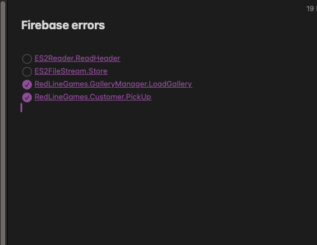

# Welcome to Base Project Documentation

We have compiled a brief documentation of the base project and other RLG packages that will help develop games with much more ease, fluidity and speed.

Please go through each page to make sure you are aware of all features and how to use them.

## Components

* GameManager.cs
* `mkdocs serve` - Start the live-reloading docs server.
* `mkdocs build` - Build the documentation site.
* `GameManager.Instance.GetCurrency` - Print help message and exit.

## Project layout

    GameManger

    mkdocs.yml    # The configuration file.
    docs/
        index.md  # The documentation homepage.
        ...       # Other markdown pages, images and other files.

> This is a blockquote.

Some of these words *are emphasized*.
Some of these words _are emphasized also_.

Use two asterisks for **strong emphasis**.
Or, if you prefer, __use two underscores instead__.

    I strongly recommend against using any `<blink>` tags.

    I wish SmartyPants used named entities like `&mdash;`
    instead of decimal-encoded entities like `&#8212;`.

Cupcake indexer is a snazzy new project for indexing small cakes.

*Above: Cupcake indexer in progress*

This is an [example link](index.md#commands "With a Title").

